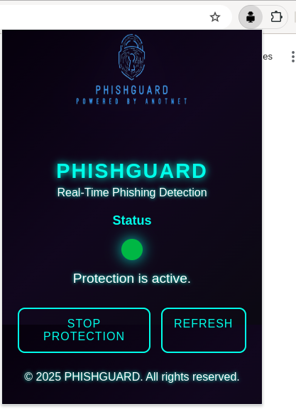
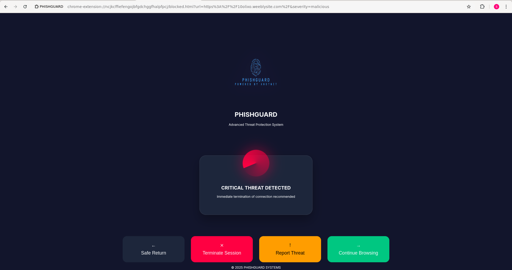

# 🛡️ PHISHGUARD: Real-Time Phishing Detection Extension

PHISHGUARD is a cutting-edge browser extension designed to protect users from phishing attacks and malicious websites in real-time. With its sleek cyberpunk-inspired design and advanced threat detection capabilities, PHISHGUARD empowers users to browse the web safely and confidently.

---

## 🌟 Features

✅ **Real-Time URL Scanning** – Automatically scans URLs using the VirusTotal API to detect malicious or suspicious sites.

✅ **Dynamic Blocking** – Blocks access to flagged websites and redirects users to a secure warning page.

✅ **User-Friendly Popup** – A modern popup interface allows users to toggle protection, view status, and refresh updates.

✅ **Crowdsourced Reporting** – Users can report phishing sites, contributing to a community-driven database of threats.

✅ **Color-Coded Warnings** – Provides clear, visually appealing warnings (🔴 red for malicious, 🟡 yellow for suspicious, 🟢 green for safe).

✅ **Lightweight & Optimized** – Minimal resource usage ensures smooth performance without slowing down your browsing experience.

---

## 🚀 Installation

### 1️⃣ From Chrome Web Store  
- Visit the PHISHGUARD page on the Chrome Web Store.  
- Click **"Add to Chrome"** and follow the prompts to install the extension.

### 2️⃣ From Source Code  
```bash
 git clone https://github.com/th-shivam/phishguard.git
```
- Open Chrome and navigate to `chrome://extensions/`.
- Enable **Developer Mode** (toggle in the top-right corner).
- Click **Load Unpacked** and select the cloned repository folder.
- PHISHGUARD will now appear in your extensions list!

---

## 🛠️ How It Works

1. **URL Monitoring** – The background script monitors all navigation events in the browser.
2. **Threat Analysis** – Each URL is sent to the VirusTotal API for real-time scanning.
3. **Blocking Malicious Sites** – If a URL is flagged as malicious or suspicious, it is blocked, and the user is redirected to a secure warning page.
4. **User Interaction** – The popup provides real-time status updates and allows users to toggle protection or refresh the state.

---

## 🎨 Design Highlights

🌌 **Cyberpunk Theme** – A futuristic design with glowing neon accents and smooth animations.  
⚡ **Interactive Animations** – Buttons pulse, indicators glow, and transitions are seamless.  
📱 **Responsive Layout** – Looks great on all screen sizes, ensuring a consistent user experience.  

---

## 📊 Impact

🌍 **Social** – Protects users from phishing scams, identity theft, and financial fraud.  
💰 **Economic** – Reduces costs associated with cybercrime and enhances business security.  
♻️ **Environmental** – Optimized for energy efficiency, minimizing resource usage.  

---

## 🔧 Development Setup

### Prerequisites
- **Node.js** (optional, for local testing)
- **Chrome Browser** (or other supported browsers like Firefox)
- **VirusTotal API Key** (for URL scanning)

### Steps
1. Obtain a free API key from **VirusTotal**.
2. Replace `YOUR_VIRUSTOTAL_API_KEY` in `background.js` with your actual API key.
3. Run the extension locally by following the **Installation** steps above.

---

## 🤝 Contributing

We welcome contributions from the community! Here’s how you can help:

📌 **Report Bugs** – Open an issue on GitHub if you encounter any problems.  
💡 **Suggest Features** – Share your ideas for new features or improvements.  
🔧 **Submit PRs** – Fork the repository, make your changes, and submit a pull request.  

Please adhere to our **Code of Conduct** when contributing.

---

## 📜 License

This project is licensed under the **MIT License**. See the [LICENSE](LICENSE) file for details.

---

## 🙌 Acknowledgments

🔍 **VirusTotal** – For providing the powerful API used for URL scanning.  
🌐 **Chrome Extensions Team** – For their excellent documentation and support for Manifest V3.  
🛠️ **Open Source Community** – For inspiration and resources that helped shape this project.  

---

## 📢 Feedback & Support

💌 **Email:** [support@phishguard.com](mailto:anotnet.shivam@gmail.com)  
🐦 **Twitter:** [@PhishGuardApp](https://twitter.com/dreamyshivam)  
📌 **GitHub Issues:** Open an issue in this repository.  

---

## 🌐 Stay Safe Online

With **PHISHGUARD**, you’re taking a proactive step toward protecting yourself and others from online threats. Together, we can create a safer internet for everyone. 💻✨

---

## 📸 Screenshots

### 🖥️ Popup Interface  


  

### 🚫 Blocked Page  
  

---

## 📣 Follow Us

⭐ **Star this repository** to show your support!  
🔗 **Share with friends** who care about online safety.  
📢 **Spread the word** about PHISHGUARD on social media.  

Thank you for choosing **PHISHGUARD**! Together, we can fight phishing and make the web a safer place. 🌍🛡️

